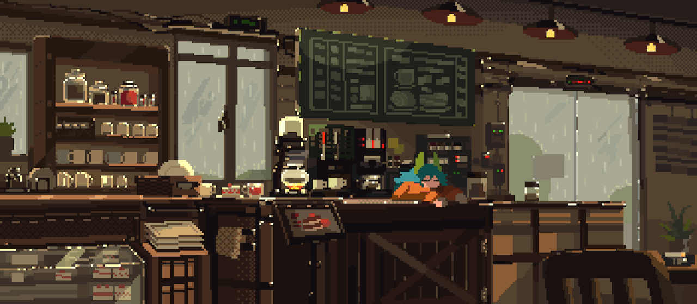
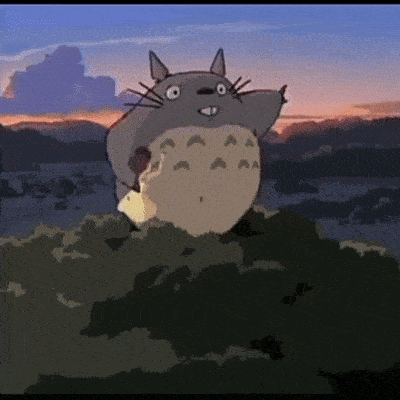
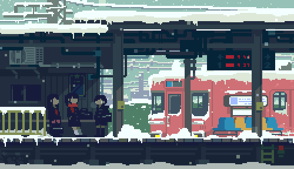

  

<h1 style="text-align: center;">🎮 Backend Adventurer | Code & Magic Alchemist</h1>

<h2 style="text-align: center;">🧝‍♂️ Character Stats</h2>
<ul style="max-width: 600px; margin: 0 auto; list-style: none; padding: 0; line-height: 1.5;">
  <li>🛠️ <strong>Role</strong>: Junior Backend Developer / Game Developer</li>
  <li>🧩 <strong>Skills</strong>: REST API, Auth Flows, SQL/NoSQL, Redis, MongoDB, Boost, Poco, gRPC, CMake ,CI/CD</li>
  <li>🧠 <strong>Traits</strong>: Fast Learner, Code Clarity Enthusiast, Team Spirit +10</li>
  <li>🧪 <strong>Tools Mastered</strong>: Git/lab, Postman, Docker (in progress)</li>
  <li>🛡️ <strong>Allies</strong>:
    <ul>
      <li>🧙‍♀️ Frontend Mages</li>
      <li>🎨 Game Designers</li>
      <li>🎭 Level Designers</li>
      <li>⚙️ Game Developer</li>
    </ul>
  </li>
</ul>

<h2 style="text-align: center;">🎯 Quests Completed</h2>

  <ul style="list-style: none; padding: 0; max-width: 600px; line-height: 1.5;">
    <li>🔧 Выжить до 21</li>
    <li>🧰 Настроил и масштабировал пайплайны в GitHub Actions / GitLab CI — от MVP до продакшена. Повторяемо, стабильно, надежно.</li>
    <li>📊 Разработал автоматические процедуры очистки логов, кэшей и артефактов — запуск по cron, событиям и webhook'ам.</li>
    <li>🗝️ Настроил двусторонние интеграции через webhook'и — уведомления, триггеры, пуши в сторонние API.</li>
    <li>🎮 Взаимодействовал с фронтенд разработчиков для игровых интерфейсов playabs</li>
    <li>💾 Database Guardian Lv.3 — Автоматизированы миграции, регулярные бэкапы и восстановление данных на staging и production средах.</li>
  </ul>
  

    
    
  

<h2 style="text-align: center;">🗺️ Current Mission</h2>
<blockquote style="max-width: 600px; margin: 0 auto; font-style: italic; text-align: center;">
  Улучшить навыки в GameDev & WebTech, собрать "добжи" стек и попасть на мальдивы.
</blockquote>

  

 As an achievement...my first completed art .p.s This is how I'm going to the Maldives.

<h2 style="text-align: center;">⚔️ Weapon Inventory (Tech Stack)</h2>

  
   
  

⚔️ Game Dev Blacksmith Forge:

  
  
  
  

<h2 style="text-align: center;">🧙‍♂️ Special Moves</h2>
<ul style="max-width: 600px; margin: 0 auto; line-height: 1.5;">
  <li>⚡ <code>Fast-Deploy</code>: Быстрая адаптация ко всему чему возможно</li>
  <li>🧠 <code>Mana Regeneration</code>: Постоянное обучение (и урон по mind)</li>
  <li>🕸️ <code>Web Hook Trap</code>: Интеграция сторонних сервисов</li>
</ul>

<h2 style="text-align: center;">📜 Spellbook (Repositories)</h2>

  
  

    
  

  <ul style="list-style: none; padding: 0; max-width: 600px; font-family: Arial, sans-serif; line-height: 1.5;">
    
*То чем занимаюсь*

    <li>🗃️ <a href="#" style="text-decoration: none; color: inherit;">Quest-Manager</a> — API для трекер</li>
    <li>🧾 <a href="#" style="text-decoration: none; color: inherit;">Player-Stats-Service</a> — CRUD для игровых данных</li>
    <li>⚙️ <a href="#" style="text-decoration: none; color: inherit;">Battle-Backend</a> — Пока в разработке</li>
  </ul>

<h2 style="text-align: center;">📡 Connect with me</h2>

  <a 
    href="https://t.me/Pojilai" 
    target="_blank" 
    style="
      display: flex;
      align-items: center;
      gap: 10px;
      background-color: #3127c0ff;
      color: white;
      text-decoration: none;
      padding: 12px 24px;
      border-radius: 8px;
      font-size: 18px;
      font-family: Arial, sans-serif;
      box-shadow: 0 0 10px rgba(69, 87, 255, 0.7);
      transition: transform 0.2s, box-shadow 0.2s;
    "
    onmouseover="this.style.boxShadow='0 0 20px rgba(255, 0, 0, 0.9)'; this.style.transform='scale(1.05)'"
    onmouseout="this.style.boxShadow='0 0 10px rgba(198, 40, 40, 0.7)'; this.style.transform='scale(1)'"
  >
    
    Зубы показываем в Telegram
  </a>

  

<!-- Footer Banner -->

  

