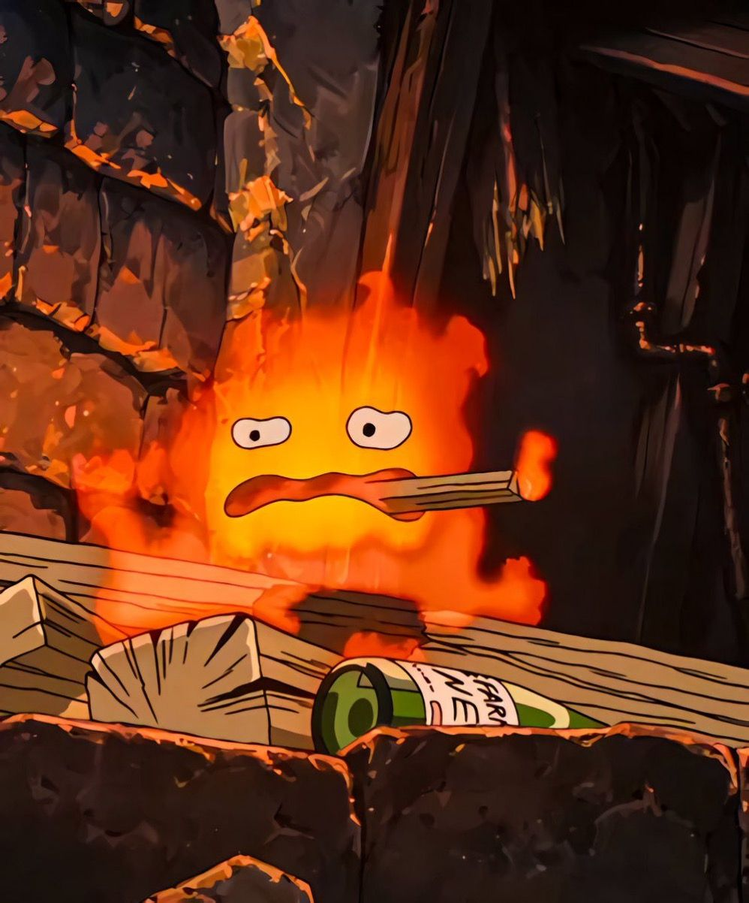

  

<h1 align="center">🎮 Backend Adventurer | Code & Magic Alchemist</h1>

<h2 align="center">🧝‍♂️ Character Stats</h2>
<ul style="max-width: 600px; margin: 0 auto; text-align: left; list-style: none; padding: 0; line-height: 1.5;">
  <li>🛠️ <strong>Role</strong>: Junior Backend Developer / Game Developer</li>
  <li>🧩 <strong>Skills</strong>: REST API, Auth Flows, SQL/NoSQL, Redis, MongoDB, Boost, Poco, gRPC, CMake ,CI/CD</li>
  <li>🧠 <strong>Traits</strong>: Fast Learner, Code Clarity Enthusiast, Team Spirit +10</li>
  <li>🧪 <strong>Tools Mastered</strong>: Git/lab, Postman, Docker (in progress)</li>
  <li>🛡️ <strong>Allies</strong>:
    <ul>
      <li>🧙‍♀️ Frontend Mages</li>
      <li>🎨 Game Designers</li>
      <li>🎭 Level Designers</li>
      <li>⚙️ Game Developer</li>
    </ul>
  </li>
</ul>

<h2 align="center">🎯 Quests Completed</h2>

<table align="center" style="width: 100vw; table-layout: fixed;">
  <tr>
    <td style="width: 50%; vertical-align: top; padding-left: 20px;">
      <ul>
        <li>🔧 Выжить до 21</li>
        <li>🧰 Настроил CI/CD пайплайны</li>
        <li>📊 Авто-очистка логов и артефактов</li>
        <li>🗝️ Вебхуки и триггеры</li>
        <li>🎮 Работа с фронтом в playabs</li>
        <li>💾 Database Guardian Lv.3</li>
      </ul>
    </td>
    <td style="width: 50%; text-align: center; vertical-align: top;">
        
      
    </td>
  </tr>
</table>

<h2 align="center">🗺️ Current Mission</h2>

  <blockquote align="center">
    Улучшить навыки в GameDev & WebTech, собрать "добжи" стек и попасть на мальдивы.
  </blockquote>

  

  <blockquote align="center">
 As an achievement...my first completed art .p.s This is how I'm going to the Maldives.
</blockquote>

<h2 align="center">⚔️ Weapon Inventory (Tech Stack)</h2>

  
   
  

⚔️ Game Dev Blacksmith Forge:

  
  
  
  

<h2 align="center">🧙‍♂️ Special Moves</h2>
<ul align="center">
  <li>⚡ <code>Fast-Deploy</code>: Быстрая адаптация ко всему чему возможно</li>
  <li>🧠 <code>Mana Regeneration</code>: Постоянное обучение (и урон по mind)</li>
  <li>🕸️ <code>Web Hook Trap</code>: Интеграция сторонних сервисов</li>
</ul>

<h2 align="center">📜 Spellbook (Repositories)</h2>
<table align="center" style="width: 100%; border-collapse: collapse;">
  <tr>
    <td style="width: 160px; vertical-align: top; padding-right: 20px;">
      
    </td>
    <td style="vertical-align: top; font-family: Arial, sans-serif; line-height: 1.5;">
      

      <ul style="list-style: none; padding-left: 0; margin-top: 0;">
        <li>🗃️ <a href="#" style="text-decoration: none; color: inherit;">Quest-Manager</a> — API для трекера квестов</li>
        <li>🧾 <a href="#" style="text-decoration: none; color: inherit;">Player-Stats-Service</a> — CRUD для игровых данных</li>
        <li>⚙️ <a href="#" style="text-decoration: none; color: inherit;">Battle-Backend</a> — Пока в разработке</li>
      </ul>
    </td>
  </tr>
</table>

<h2 align="center">📡 Contact with me</h2>

  

<!-- GIF на всю ширину -->

  

